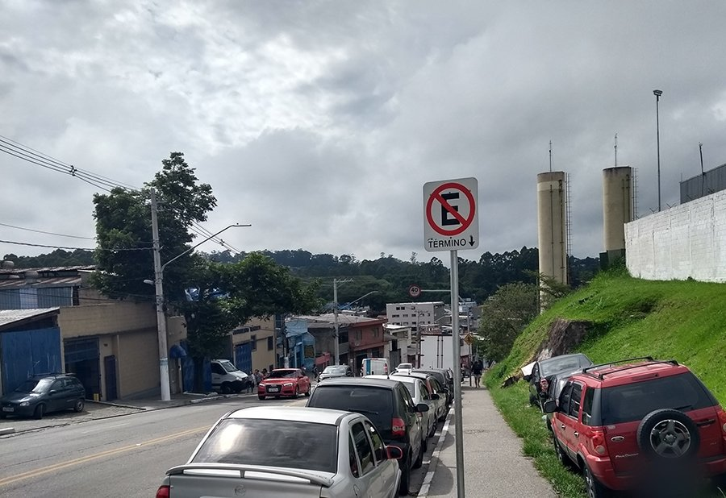

# Análise de Texto com OCR no Azure  

Este repositório contém um projeto de reconhecimento de texto em imagens utilizando a API de OCR do Azure. O objetivo é avaliar a precisão da ferramenta ao identificar textos em placas de trânsito e analisar seus desafios e limitações.  

## Estrutura do Repositório  
- **inputs/** → Imagens utilizadas para o reconhecimento de texto.  
- **outputs/** → Resultados processados pela API, incluindo textos extraídos e análises.  
- **README.md** → Documentação do projeto, insights obtidos e próximos passos.  

---

## Pass a Passo

### 1. Criar um Serviço de OCR no Azure  
1. Acesse o [Portal do Azure](https://portal.azure.com/).  
2. No menu lateral, clique em **"Criar um recurso"**.  
3. Busque por **"Cognitive Services"** e clique para criar.  
4. Escolha a opção **"Computer Vision"**, que inclui a funcionalidade de OCR.  
5. Preencha as informações necessárias:  
   - Nome do recurso  
   - Região  
   - Tipo de preço (escolha a opção gratuita, se disponível)  
6. Após a criação, vá até **"Chaves e Endpoint"** e copie as credenciais.
7. Utilize as **"Chaves e Endpoint"** para se autorizar e fazer as requisições. 

### Imagem 1: Placa "PARE"  
A API identificou corretamente a palavra **"PARE"** com alta precisão (99%).  

  

**Insight:** O OCR teve um ótimo desempenho com essa imagem, possivelmente devido ao alto contraste e fonte padrão das placas de trânsito.  

---

### Imagem 2: Placa de Proibido Estacionar + "Término"  
**Texto identificado:** `"TÉRMINO"` e `"40"`  
A API reconheceu corretamente a palavra **"TÉRMINO"**, mas identificou o número **"40"**, que não faz parte do texto principal da placa.  

  

**Insight:** O OCR teve um bom desempenho na detecção da palavra principal, mas também capturou informações que podem ter vindo de outros elementos próximos na imagem. Isso destaca a importância de um pós-processamento para filtrar apenas os textos relevantes.  

---

### Imagem 3: Placa de Limite de Altura (6m)  
**Texto identificado:** `"6,0 m"`, além de palavras soltas como `"LOS"`, `"PE"`, `"os"`.  

  

O valor principal da placa ("6,0 m") foi identificado corretamente, mas a API captou palavras de outras placas ou elementos visuais próximos.  

**Insight:** Em imagens com múltiplas fontes de texto (como placas próximas ou adesivos em veículos), o OCR pode capturar elementos inesperados.  

---

## O que Aprendi  
- O **Azure OCR** tem um alto nível de acurácia para textos padronizados e bem contrastantes.  
- Símbolos pequenos ou pouco visíveis podem ser mal interpretados.  
- Em ambientes urbanos, onde há múltiplos textos, o OCR pode capturar informações além do esperado.  
